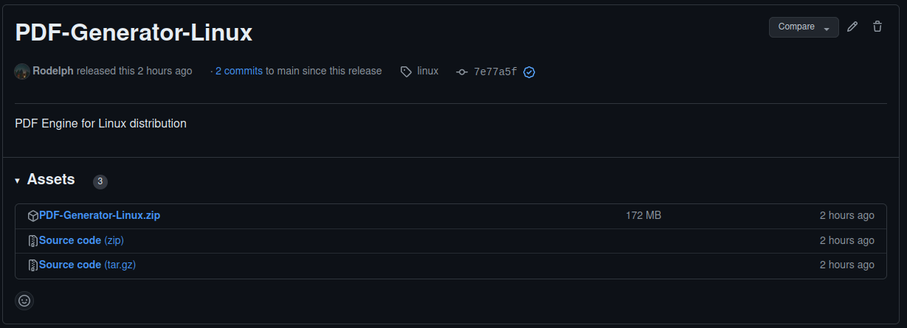

# Setup to run and compile from Source

1 - Install all python libraries

```
pip install -r requirements.txt
```
2 - Generate the documents to view. Using Github as a database, open the terminal in PDFGenerator directory and use the following command :
 
```
python PDFEngineGit.py
```

To use JSON-IO as a database, open the terminal in PDFGenerator directory and use the following command :
 
```
python PDFEngineIO.py
```

3 - Insert the link of the web page the you want to generate as pdf. You can even import a pdf file that is already downloaded on the computer.


4 - An output file will be created in the CacheData folder. It will contain AR markers and QR codes for the AR part.


5 - Generate Exe Files by first 

* Installing pyinstaller library from pip.
    ```
    pip install pyinstaller
    ```

* Generate the necessary files and folders for the executable file.
    ```
    pyinstaller --onefile PDFEngineIO.py
    ```
    or
    ```
    pyinstaller --onefile PDFEngineGit.py
    ```
    More info can be found in this [link](https://www.datacamp.com/tutorial/two-simple-methods-to-convert-a-python-file-to-an-exe-file).


# Run from release

- If you want to run the windows version project please download the executable file from [here](https://github.com/seanscofield/archivist/releases/tag/Windows_JSON).


- If you want to run the linux version project please download the executable file from [here](https://github.com/Rodelph/ARCHIVIST/releases/tag/linux).


